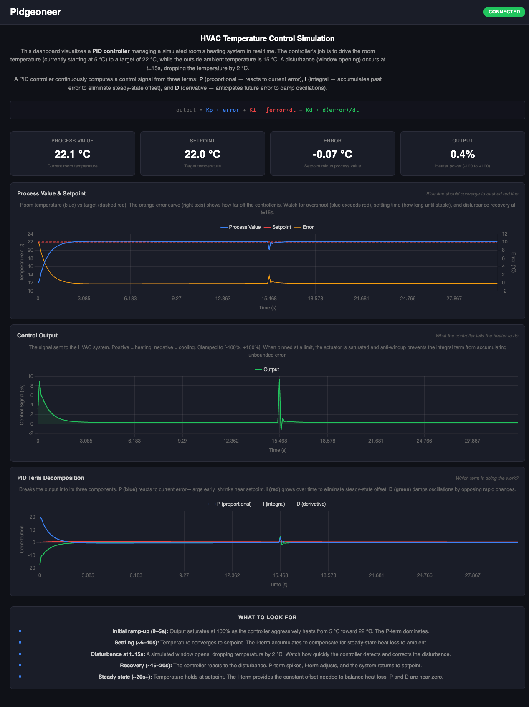

# 🐦 Pidgeon: The PID Controller 

<p align="center">
  
</p>

## Delivering Rock-Solid Performance Since 2025 - No War Zone Required

[](https://github.com/security-union/pidgeon/actions/workflows/ci.yml)

## What is Pidgeon?

Pidgeon is a high-performance, thread-safe PID controller library written in Rust.

The name pays homage to history's most battle-tested messengers. In both World Wars, carrier pigeons maintained 95% delivery rates [^1] while flying through artillery barrages, poison gas, and enemy lines. Cher Ami, a famous war pidgeon, delivered a critical message despite losing a leg, an eye, and being shot through the chest. Like these feathered veterans, our PID controller is engineered to perform reliably when everything else fails. It might not win the Croix de Guerre like Cher Ami did, but it'll survive your chaotic production environment with the same unflappable determination.

## Why Pidgeon?

Pidgeon is designed for developers who need a robust, high-performance PID controller for real-time control applications. Whether you're building a drone, a robot, or a smart thermostat, Pidgeon provides the precision and reliability you need to keep your system on track.

## Features

- **Thread-safe**: ThreadSafePidController ensures safe concurrent access to your PID controller, perfect for multi-threaded applications, it implements the `Clone` trait so that you can easily share the controller across threads.
- **High-performance**: With sub-microsecond computation times, perfect for real-time robotics and drone applications requiring 1kHz+ control loops.
- **`no_std` support**: Core types (`ControllerConfig`, `PidState`, `pid_compute()`) work without `std` -- bring your own allocator, or don't. Build with `--no-default-features` for embedded targets.
- **Derivative modes**: Choose `DerivativeMode::OnMeasurement` (default) to eliminate derivative kick on setpoint changes, or `DerivativeMode::OnError` for classical behavior. IIR low-pass filter on the derivative term tames noise.
- **Anti-windup strategies**: `AntiWindupMode::Conditional` (default), `BackCalculation` with configurable tracking time, or `None` if you enjoy watching integrals explode.
- **Use case agnostic**: From quadcopter stabilization to temperature control to maintaining optimal coffee-to-code ratios, Pidgeon doesn't judge your control theory applications.
- **Written in Rust**: Memory safety without garbage collection, because who needs garbage when you've got ownership?
- **Minimal dependencies**: Doesn't pull in half of crates.io.

## Quick Start

### Basic Drone Stabilization Example

```bash
cargo run --example drone_altitude_control
```

<p align="center">
    <video src="https://github.com/user-attachments/assets/ba0cf3f6-d61b-4323-bed1-c9be2dbeb851"  width="600"></video>
</p>

#### Drone Altitude Simulation

The visualization above shows our PID controller in action, maintaining a quadcopter's altitude despite various disturbances. This simulator models real-world drone physics including:

- **Accurate Flight Dynamics**: Simulates mass, thrust, drag, and gravitational forces
- **Controller Response**: Watch the PID controller adjust thrust to maintain the 10-meter target altitude
- **Multiple Visualizations**: The four-panel display shows Altitude, Velocity, Thrust, and Error over time
- **Environmental Disturbances**: Red exclamation marks (!) indicate wind gusts hitting the drone
- **Physical Events**: At the 30-second mark, a payload drop reduces the drone's mass by 20%
- **Battery Simulation**: Gradual thrust reduction simulates battery voltage drop over time

The visualization demonstrates how the PID controller responds to these challenges:
1. Initial ascent to target altitude with proper damping (minimal overshoot)
2. Rapid recovery from unexpected wind gusts (external disturbances) (red lines)
3. Automatic adaptation to the lighter weight after payload drop (system parameter changes) (red lines)
4. Compensation for decreasing battery voltage (actuator effectiveness degradation)

Each of these scenarios demonstrates real-world challenges that PID controllers solve elegantly. The beautiful visualization makes it easy to understand the relationship between altitude, velocity, thrust adjustments, and error over time.

### Thread-Safe Controller for Multi-Threaded Applications

This example demonstrates how to create a Controller, please refer to the examples directory for complete programs.

```rust
use pidgeon::{ControllerConfig, ThreadSafePidController};
use std::{thread, time::Duration};

const SETPOINT_ALTITUDE: f64 = 10.0; // Target altitude in meters

fn main() {
    // Create a PID controller with carefully tuned gains for altitude control
    let config = ControllerConfig::builder()
        .with_kp(10.0) // Proportional gain - immediate response to altitude error
        .with_ki(5.0) // Integral gain - eliminates steady-state error (hovering accuracy)
        .with_kd(8.0) // Derivative gain - dampens oscillations (crucial for stability)
        .with_output_limits(0.0, 100.0) // Thrust percentage (0-100%)
        .with_setpoint(SETPOINT_ALTITUDE)
        .with_deadband(0.0) // Set deadband to zero for exact tracking to setpoint
        .with_anti_windup(true) // Prevent integral term accumulation when saturated
        .build()
        .expect("Invalid PID configuration");

    let controller = ThreadSafePidController::new(config);
}
```

## License

Pidgeon is licensed under either of:

* [Apache License, Version 2.0](LICENSE-APACHE)
* [MIT License](LICENSE-MIT)

at your option.

### Contribution

Unless you explicitly state otherwise, any contribution intentionally submitted for inclusion in the work by you, as defined in the Apache-2.0 license, shall be dual licensed as above, without any additional terms or conditions.

## Performance Benchmarks

Pidgeon is designed for high-performance control applications. v0.3.0 added input validation, derivative filtering, and `Result` returns -- about 2.4x slower than v0.2.1 in microbenchmarks, still ~9 ns/call. A 100 kHz control loop uses less than 0.1% of one core.

| Benchmark               | Time            | Per-call   | Description                                                      |
|-------------------------|-----------------|------------|------------------------------------------------------------------|
| `pid_compute`           | 926 ns / 100    | ~9.3 ns    | Single-threaded, 100 consecutive updates                        |
| `thread_safe_pid_compute` | 1,022 ns / 100 | ~10.2 ns  | Mutex-wrapped, no contention                                     |
| `multi_threaded_pid`    | 25,220 ns       | --         | 2 threads: 50 writes + 20 reads                                 |

*Measured on Apple Silicon. Your mileage will vary, but probably not by much.*

### Running Benchmarks

```bash
cargo bench --package pidgeon --features benchmarks
```

## Demo Application: `run_pidgeon_demo.sh`

Experience Pidgeon in action with our comprehensive demo application! The `run_pidgeon_demo.sh` script launches a complete demonstration environment:

```bash
./run_pidgeon_demo.sh
```

<p align="center">
  
</p>

The Pidgeoneer dashboard visualizes PID controller behavior in real time, showing an HVAC simulation where the controller drives room temperature from 5°C to a 22°C setpoint. Three time-series charts break the response into process value vs. setpoint, control output, and individual P/I/D term contributions -- making it easy to see exactly how each gain shapes the response. A simulated disturbance at t=15s (a window opening) demonstrates disturbance rejection. Whether you are tuning gains or learning how PID control works, this is the fastest way to build intuition.

**Requires Docker** for the [Iggy](https://iggy.rs) message server (the script handles the container automatically).

This script starts:
1. **Pidgeoneer Leptos Web Server** - A beautiful web dashboard running on port 3000
2. **Temperature Control PID Demo** - A real-time example showing PID control in action

The demo provides:
- Real-time visualization of temperature control
- Live updates of PID controller parameters
- Performance metrics and response curves
- Interactive dashboard for monitoring controller behavior

The web-based interface allows you to observe the PID controller's performance as it manages temperature control, with live graphs showing setpoint, actual temperature, and control signals.

```bash
# After starting the demo:
# 1. The script launches the Pidgeoneer web server
# 2. Opens your browser to http://localhost:3000
# 3. Waits for you to press 'S' to start the actual PID controller
# 4. Press Ctrl+C when you're done to clean up all processes
```

## Debugging Features

Pidgeon provides comprehensive debugging capabilities to assist with controller tuning and analysis:


- **Performance Metrics**: Real-time calculation of rise time, settling time, overshoot, and steady-state error
- **Response Visualization**: Export control data to view beautiful Bode plots without leaving your terminal
- **Gain Scheduling Detection**: Automatically detects when your system would benefit from gain scheduling

Enable debugging by adding the `debugging` feature to your Cargo.toml:

```toml
# In your Cargo.toml
[dependencies]
pidgeon = { version = "0.3", features = ["debugging"] }
```

Configuration example:

```rust
use pidgeon::{ControllerConfig, ThreadSafePidController, DebugConfig};

// Create your controller configuration
let config = ControllerConfig::builder()
    .with_kp(2.0)
    .with_ki(0.1)
    .with_kd(0.5)
    .with_output_limits(-100.0, 100.0)
    .with_anti_windup(true)
    .with_setpoint(22.0)
    .build()
    .expect("Invalid PID configuration");

// Create debug configuration to stream data to Iggy
let debug_config = DebugConfig {
    iggy_url: "127.0.0.1:8090".to_string(),
    stream_name: "pidgeon_debug".to_string(),
    topic_name: "controller_data".to_string(),
    controller_id: "temperature_controller".to_string(),
    sample_rate_hz: Some(10.0), // 10Hz sample rate
};

// Create controller with debugging enabled
let controller = ThreadSafePidController::new(config)
    .with_debugging(debug_config)
    .expect("Failed to initialize controller with debugging");

// Your controller is now streaming debug data to Iggy
// which can be visualized in real-time using Pidgeoneer!
```

When you run the application, all controller data is streamed to the configured Iggy server, where it can be visualized and analyzed in real-time through the Pidgeoneer dashboard. This gives you unprecedented visibility into your controller's behavior without compromising performance.

## Real-time Diagnostics with Iggy.rs

In production environments, monitoring your PID controllers is just as critical as tuning them properly. That's why Pidgeon integrates with [Iggy.rs](https://iggy.rs) - the blazing-fast, rock-solid streaming platform built in Rust.

### Why We Stream Diagnostic Data

Traditional logging methods fall short for real-time control systems:
- Log files become unwieldy for high-frequency control data
- In-memory buffers risk data loss during crashes
- Debugging becomes a post-mortem activity instead of real-time observability

### Enter Iggy.rs

Iggy.rs provides the perfect solution for streaming controller telemetry:

### What Gets Streamed

Every aspect of your controller's performance is captured in real-time:
- Raw control signals, setpoints, and process variables
- Derivative and integral components
- Timing information (execution time, jitter)
- System response characteristics
- Auto-tuning activities and recommendations

### Why Iggy.rs?

When we evaluated streaming platforms for Pidgeon, Iggy.rs stood out for several reasons:

1. **Performance**: Written in Rust, Iggy delivers blazing-fast throughput with minimal overhead - essential for control systems with microsecond decision loops
2. **Reliability**: Rock-solid design ensures your diagnostic data never gets lost, even during system disruptions
3. **Scalability**: From a single embedded controller to thousands of distributed control nodes, Iggy scales effortlessly
4. **Rust Native**: No FFI overhead or serialization bottlenecks - seamless integration with our codebase
5. **Stream Processing**: Analyze control behavior in real-time with Iggy's powerful stream processing capabilities
6. **Ecosystem**: Growing community with excellent tools for visualization and analysis

As the hottest streaming platform in the Rust ecosystem, Iggy was the obvious choice for Pidgeon. When your PID controller is making mission-critical decisions thousands of times per second, you need diagnostics that can keep up.

## Appendix: The PID Algorithm in Pidgeon

### The Textbook vs. The Real World

The textbook PID equation is elegant: `u(t) = Kp*e(t) + Ki*∫e(τ)dτ + Kd*de/dt`. Three terms, three gains, done.

Nobody ships that to production.

Raw derivatives amplify sensor noise. Setpoint changes cause derivative spikes. Integral terms wind up when actuators saturate. The textbook equation is the Wright Flyer -- historically important, but you wouldn't fly it across the Atlantic.

Pidgeon implements a production-grade PID with filtered derivative, anti-windup, deadband, and a pure-function architecture that works from `no_std` embedded targets to WASM browsers. Here's exactly what `pid_compute()` does on every call.

### Algorithm Step-by-Step

Given inputs `(config, state, process_value, dt)`:

**1. Validate inputs**

Reject non-finite or non-positive `dt`, and non-finite `process_value`. Fail fast, fail loud.

**2. Compute error and apply deadband**

```
error = setpoint - process_value

if |error| <= deadband:
    working_error = 0
else:
    working_error = error - deadband * sign(error)
```

The deadband creates a "close enough" zone around the setpoint where P and I stop reacting. This prevents chatter in systems with discrete actuators (like a relay that shouldn't toggle every cycle). The deadband is subtracted from the magnitude, not zeroed -- so a 2.0 deadband with error=5.0 gives working_error=3.0, not 5.0.

**3. Proportional term**

```
P = Kp * working_error
```

Nothing exotic here. Proportional response to the deadband-adjusted error.

**4. Integral term**

```
integral_contribution += Ki * working_error * dt
```

A critical design choice: the integral stores `Ki * ∫error·dt`, not the raw integral. Ki is baked into the accumulator. This seems like a minor bookkeeping detail, but it eliminates a division-by-Ki singularity in back-calculation anti-windup (see step 8). When Ki=0, the integral contribution is always 0 -- no special cases, no division by zero.

**5. Derivative term (where it gets interesting)**

The derivative computation has three stages:

**(a) Raw derivative -- choose your mode**

```
OnMeasurement (default):  raw = -(process_value - prev_process_value) / dt
OnError:                  raw = (working_error - prev_error) / dt
```

**Derivative on measurement** is the default for good reason. When a setpoint changes abruptly (say, you command your drone from 10m to 20m), the error jumps instantly. The derivative of that jump is a massive spike -- "derivative kick" -- that slams your actuator. But the *measurement* (actual altitude) changes smoothly regardless of what you asked for. By differentiating `-d(pv)/dt` instead of `d(error)/dt`, the D term only responds to what the system is actually doing, not what you told it to do.

The negative sign is because increasing process_value (moving toward setpoint) should produce negative derivative action (reduce output), which is the damping behavior you want.

**(b) IIR low-pass filter**

```
alpha = N * dt / (1 + N * dt)
filtered = prev_filtered + alpha * (raw - prev_filtered)
```

Raw derivatives are noise amplifiers. Pidgeon applies a first-order IIR (infinite impulse response) low-pass filter with configurable coefficient `N` (default: 10). This is the standard derivative filter from ISA/textbook implementations:

- **N = 2-5**: Heavy smoothing. Use when sensors are noisy.
- **N = 10**: The standard default. Good balance for most systems.
- **N = 20-100**: Light filtering. Use when you need fast derivative response and have clean sensors.

The filter's cutoff frequency is approximately `N / (2*pi)` times the controller bandwidth, so higher N lets more high-frequency content through.

**(c) Apply Kd at output time**

```
D = Kd * filtered
```

Kd is *not* baked into the filter state. The filter operates on the raw derivative, and Kd multiplies the result at output time. This means you can change Kd at runtime (for gain scheduling, tuning, etc.) without corrupting the filter's internal state. The filter keeps tracking the true derivative of the signal regardless of what gain you multiply it by.

**6. Sum, clamp, and first-run handling**

```
unclamped = P + integral_contribution + D
output = clamp(unclamped, min_output, max_output)
```

On the **first call**, D is forced to 0 (no previous measurement exists), but P and I compute normally. v0.2 returned 0.0 on the first call, which was physically wrong -- a drone hovering at 10m needs ~39% thrust just to counteract gravity, and returning zero means "fall out of the sky for one cycle." v0.3 computes the real P+I output immediately.

**7. Anti-windup (only when output saturates)**

When `output != unclamped` (the clamp engaged), the integral has accumulated error it can never act on. Left unchecked, it keeps growing, and when the setpoint finally changes, the swollen integral causes massive overshoot. Pidgeon offers three strategies:

- **`None`**: No correction. The integral does whatever it wants. Useful for systems where saturation is impossible or where you want to handle windup yourself.

- **`Conditional`** (default): Simply undo this step's integral accumulation:
  ```
  integral_contribution -= Ki * working_error * dt
  ```
  The integral freezes at its current value during saturation. Simple, effective, and the right choice for most systems.

- **`BackCalculation`**: Adjust the integral based on how far the output was clamped:
  ```
  integral_contribution += (output - unclamped) * dt / tracking_time
  ```
  This actively *drains* the integral toward a value consistent with the saturated output. The `tracking_time` parameter controls how fast: smaller values = faster correction, larger values = gentler. Because the integral already stores `Ki * ∫error·dt`, there's no `1/Ki` division here -- back-calculation works cleanly even when Ki is tiny.

**8. Store state and return**

```
state = { integral_contribution, prev_error, prev_measurement,
          prev_filtered_derivative, last_output, first_run: false }
return Ok((output, new_state))
```

The entire computation is a **pure function**: `(config, state, pv, dt) -> (output, new_state)`. No internal clocks, no heap allocation, no side effects. This makes it trivially testable (inject any state you want), `no_std` compatible, and deterministically replayable -- feed the same sequence of inputs and you get the same outputs, always.

### Why PID Controllers Endure

PID control has been the workhorse of industrial automation since Nicolas Minorsky's 1922 paper, and an estimated 95% of all industrial control loops still use it. Not because engineers lack imagination, but because PID provides the best ratio of "works well enough" to "things that can go wrong." You don't need a mathematical model of your plant. You can tune it empirically. And when something changes -- a new load, a degraded sensor, a different operating point -- a well-tuned PID adapts gracefully.

As Karl Astrom put it: "PID control is an important technology that has survived many changes in technology, from mechanics and pneumatics to microprocessors via electronic tubes, transistors, integrated circuits."

Pidgeon carries that tradition forward with a Rust implementation that's fast enough for 100kHz control loops, safe enough for multi-threaded systems, and small enough for embedded targets. Like its namesake, it just keeps delivering.

### References

[^1] In the Era of Electronic Warfare, Bring Back Pigeons
 [warontherocks.com](https://warontherocks.com/2019/01/in-the-era-of-electronic-warfare-bring-back-pigeons/#:~:text=Pigeons%20demonstrated%20reliability%20as%20messengers,message%20rates%20at%2099%20percent.)

Unless you explicitly state otherwise, any contribution intentionally submitted for inclusion in the work by you, as defined in the Apache-2.0 license, shall be dual licensed as above, without any additional terms or conditions.
